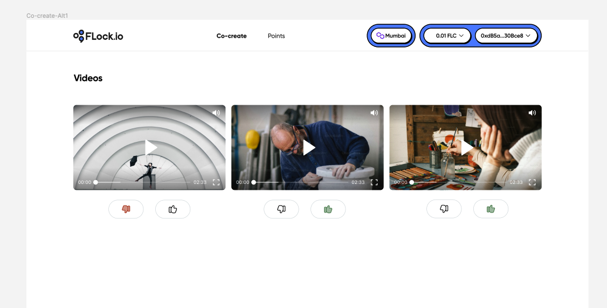

# FLock Hackathon Submission
## Leveraging Livepeer for Decentralized Generative Model Building

FLock is a cutting-edge platform designed to harness the power of community collaboration for the development and refinement of generative models. By integrating Livepeer's decentralized streaming infrastructure, FLock offers a unique approach to model training, prompt engineering, and feedback collection. We want to help community to build a video generation model that prefectly fits its need and enable them to use AI to generate more and more contents on Livepeer's platform.

## Overview

1. [Introduction](#introduction)
2. [Generating Videos with Custom Prompts](#generating-videos-with-custom-prompts)
3. [Uploading Videos to Livepeer](#uploading-videos-to-livepeer)
4. [Embedding Livepeer Videos for Community Feedback](#embedding-livepeer-videos-for-community-feedback)
5. [Voting and Feedback Mechanism](#voting-and-feedback-mechanism)
6. [Conclusion](#conclusion)

## Introduction

FLock aims to democratize the process of generative model development, particularly in the realm of text-to-video conversion. By allowing the community to contribute prompts and subsequently vote on the generated video outputs, FLock facilitates a collaborative environment for model improvement. The integration with Livepeer is crucial, as it ensures a decentralized, scalable, and cost-effective solution for video streaming and hosting, which is essential for the feedback and voting process.

## Generating Videos with Custom Prompts

A frontend will be built for user to submit the prompt for a given task. The backend will send the prompt to a text2video model built and hosted by FLock.

## Uploading Videos to Livepeer

Upon successful video generation:

1. **Automatic Upload**: The video is automatically uploaded to Livepeer's decentralized video streaming infrastructure. This process ensures that your video is stored securely and is ready for community viewing.
2. **Retrieving Video playbackId**: After the upload, a playbackId for the video hosted on Livepeer is generated.

## Embedding Livepeer Videos for Community Feedback

1. **Embedding Videos**: The  playbackId URL is embedded with the Player into the FLock frontend. This allows community members to easily watch the generated videos.
2. **Providing Feedback**: Community members can watch the videos and provide feedback directly on the platform. This feedback is crucial for understanding the effectiveness of the prompts and the quality of the generated videos.

## Voting and Feedback Mechanism

1. **Voting on Videos**: Alongside feedback, community members can vote on their preferred videos. Each vote is recorded on a smart contract, ensuring transparency and immutability.

This image represents the FLock user interface, where community members can watch and provide feedback on the generated videos.

2. **Smart Contract Integration**: The smart contract keeps a tally of votes for each video submission, allowing the community to democratically select the best prompts.
3. **Model Fine-tuning**: The collective feedback and voting results are used to fine-tune the text-to-video models, ensuring they meet the community's expectations and requirements.

## Conclusion

FLock, powered by Livepeer's decentralized video infrastructure, represents a significant advancement in collaborative model development. By engaging the community in prompt engineering, feedback provision, and voting, FLock not only improves the quality of generative models but also fosters a sense of ownership and participation among its users. The integration with Livepeer is instrumental in achieving this goal, providing a scalable, cost-effective, and decentralized solution for video streaming and hosting. We encourage everyone to contribute, participate, and help shape the future of generative models.